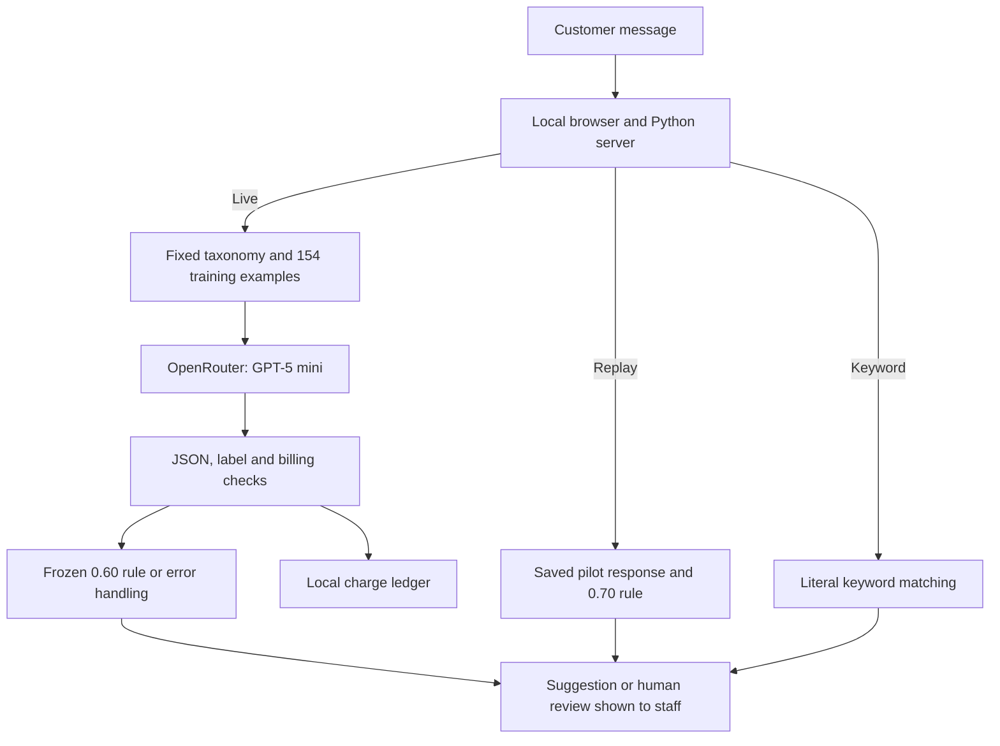

# TicketRoute product documentation

Tu Weikang | PE6201 Individual Final Project

## User and intended value

My design persona is Mei, a digital-bank support supervisor who receives short
English customer messages and assigns them to specialist queues. She understands
the support process but should not need to interpret model internals. TicketRoute
shows a suggested intent, a short reason and whether the message needs review.
The staff member remains responsible for the routing decision; the prototype
does not connect to a bank's ticketing system.

The proposed change is to start triage with a suggestion instead of reading and
sorting every message from scratch. At an assumed 15 seconds per message,
sorting 1,000 messages takes about 4.2 staff hours. This is a planning assumption:
I have not measured staff time saved or tested the interface with bank staff.

## Input and output

| Item | Contract |
| --- | --- |
| Input | One English banking-support message, 1 to 1,000 characters after trimming surrounding whitespace. |
| Live model output | One of the 77 BANKING77 intents, a model-reported confidence score from 0 to 1, and a short reason. |
| Routing output | A suggested queue if confidence is at least the frozen 0.60 threshold; otherwise `HUMAN_REVIEW`. A service, billing or output-validation error produces a visible review/error message. |
| Recorded replay | A saved pilot response and its known dataset label, using the original 0.70 rule. The query must match a recorded pilot example. No new inference occurs. |
| Keyword mode | A deterministic intent suggestion from literal word matching, without model confidence or an API call. |

The confidence score is not a calibrated probability. The 77 labels are the
benchmark's support intents, not verified production queue names. The system
does not answer customers, access accounts, approve payments or execute routes.
Multilingual, multi-intent and out-of-domain reliability have not been evaluated.

## Architecture

`app.py` serves the interface on `127.0.0.1:8765` by default. The live branch
uses one structured model request. `ticketroute/openrouter_client.py` builds the
prompt and validates the response; `ticketroute/calibration.py` loads the rule
chosen on validation. The browser's separate local charge ledger is
`results/demo_attempts.jsonl`, created only when live calls are attempted.
Replay and keyword branches stay local. Staff act on the suggestion outside
this prototype.

Batch evaluation uses the same prompt and client through
`scripts/run_project.py`: freeze configuration, finish validation, freeze the
threshold, then run the official test. It saves row-level responses and costs
under `results/`. See [the evaluation guide](results/README.md) for the evidence
and reproduction commands.

## Build and buy choices

| Layer | Choice and reason |
| --- | --- |
| Interface and serving | Own: Python standard-library local web interface, with no additional runtime packages. |
| Orchestration and rules | Own: prompt assembly, label checks, review threshold, caching and spending controls. A single classification does not require an agent loop. |
| Model | Rent: GPT-5 mini through OpenRouter. This avoids training and hosting, while introducing recurring cost, latency and provider dependence. |
| Data | Reuse: public, licensed BANKING77 files. Prompt examples come only from the training core. No document-retrieval service is needed. |
| Evaluation and observability | Own: baselines, fixed-label metrics, validation selection, response caches, charge ledger and offline audit. |

Python gives direct control over these rules and evidence, which is why I chose
it instead of a low-code workflow. My proposal estimated one day for the first
working slice and under five minutes for local launch with Python installed;
these are planning estimates, not measured development times. The first slice
was one message, one model call and one displayed routing suggestion.

## Targets and achieved results

The completed evaluation is dated 28 September 2026, Singapore time. The
original targets and selection rule are retained in
[`results/evaluation_lock.json`](results/evaluation_lock.json).

| Metric | Target or comparison rule | Achieved result |
| --- | --- | --- |
| Macro-F1 across all 77 intents | Primary target: at least 0.80 | 0.8489 on 3,080 official test rows. |
| Accepted-route accuracy | Select the lowest candidate threshold reaching at least 85% on validation | Threshold 0.60; validation 85.06%, test 85.70%. |
| Overall accuracy | Compare with implemented non-AI baselines | Model 85.23%; keyword 38.08%; majority 1.30%. |
| Review and coverage | Measure both; no separate numeric target | 31 test rows deferred; 3,049 accepted, or 98.99% coverage. |
| Errors sent to review | Measure whether deferral catches errors | 19 of 31 deferred rows would be wrong; 436 wrong predictions still accepted. |
| Recorded API cost | Local evaluation stop at US$7 with a US$0.05 reserve | US$2.381836 for 4,976 new calls; historical pilot cost unknown. |
| Test latency | Observe response time; no service-level target | Median 2.19 seconds; 95th percentile 3.696 seconds. |
| Staff time saved | Proposed operational benefit | Not measured. |

The main metric target was met, but the review rule catches only 19 of 455 test
errors. This supports a supervised trial, not autonomous deployment. Frequent
errors involve neighbouring intents, especially unrecognised direct-debit and
card payments. Public benchmark performance does not establish performance on
current local tickets. The measured cost also benefited from prompt caching.

The next trial should measure corrected routes and actual staff time using
appropriately authorised tickets. Privacy masking, access control, drift
monitoring and sampling of accepted routes remain future work. Implemented
controls and their limitations are described in the
[main README](README.md#design-choices-and-limitations) and
[trade-off report](submission/TicketRoute_Tradeoff_Report.md).
